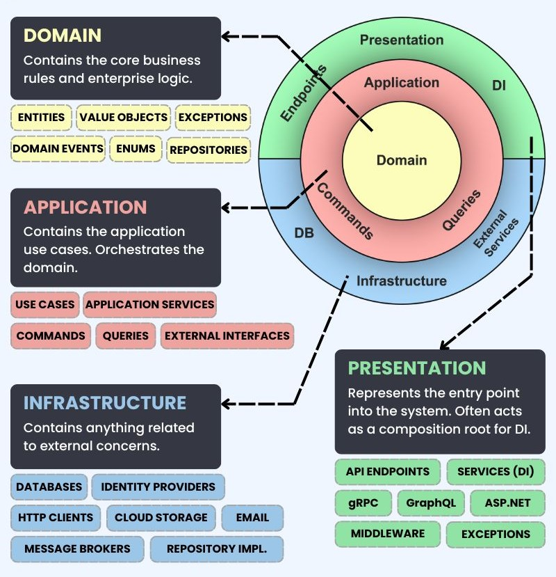

# Venda de Tickets de Eventos

## Descrição
Este projeto é uma aplicação desenvolvida em **Go** utilizando boas práticas de programação como **Clean Code** e **Domain-Driven Design (DDD)**. Ele é dedicado à venda e gestão de tickets para eventos, oferecendo funcionalidades robustas para o gerenciamento de eventos, spots (lugares/cadeiras) e tickets (ingressos).

# Documentação do Projeto



## Exploração de Entidades

### Event
- Descrição: Representa um evento que pode ter múltiplos ingressos e lugares associados.
- Responsabilidades:
  - Gerenciar e validar os detalhes do evento.
  - Adicionar e gerenciar os lugares (Spots) disponíveis para o evento.

### Ticket (Ingresso)
- Descrição: Representa um ingresso emitido para um usuário para um evento específico.
- Responsabilidades:
  - Calcular o preço do ingresso.
  - Validar os dados do ingresso para garantir que estão corretos e completos.

### Spot (Lugar / Cadeira)
- Descrição: Representa um lugar ou cadeira específico em um evento.
- Responsabilidades:
  - Validar os detalhes do lugar.
  - Gerenciar o processo de reserva de lugares.
  - Serviço de domínio: gerar novos lugares para um evento.

## Domínio

### Event
- Métodos:
  - `Validate()`: Valida os detalhes do evento, como datas, localização e capacidade.
  - `AddSpot(spot: Spot)`: Adiciona novos lugares ao evento.

### Spot
- Métodos:
  - `Validate()`: Valida os detalhes do lugar, garantindo que estão corretos e não duplicados.
  - `Reserve()`: Realiza a reserva do lugar como parte do processo de compra.
  - **Serviço de Domínio**: `GenerateSpots(event: Event, numberOfSpots: int)`: Gera um número específico de lugares para um evento.

### Ticket
- Métodos:
  - `CalculatePrice()`: Calcula o preço do ingresso baseado em fatores como localização do lugar, tipo de evento e outras variáveis.
  - `Validate()`: Valida os detalhes do ingresso, garantindo que estão completos e corretos.

### Definição de Acessos Externos (Repository)

- Objetivo: Definir interfaces e métodos para acesso a dados persistidos relacionados a eventos, lugares e ingressos.

## Infraestrutura / Repositório - Acesso ao Banco de Dados

### Repository

- Métodos:
  - `ListEvents()`: Lista todos os eventos disponíveis.
  - `FindEventById(eventId: string)`: Encontra um evento específico pelo seu identificador.
  - `CreateEvent(event: Event)`: Cria um novo evento.
  - `CreateSpot(eventId: string, spot: Spot)`: Cria e associa um novo lugar a um evento.
  - `CreateTicket(eventId: string, ticket: Ticket)`: Cria um novo ingresso para um evento.
  - `ReserveSpot(eventId: string, spotId: string)`: Reserva um lugar específico para um evento.
  - `FindSpotsByEventID(eventId: string)`: Encontra todos os lugares associados a um evento específico.
  - `FindSpotByName(spotName: string)`: Encontra um lugar específico pelo seu nome.

## Casos de Uso

### ListEvents

- Descrição: Recupera uma lista de todos os eventos disponíveis no sistema.

### GetEvent

- Descrição: Recupera os detalhes de um evento específico.

### CreateEvent

- Descrição: Criar um novo evento relacionado com o partner

### CreateSpots

- Descrição: Cria e associa um novo lugar a um evento.

### ListSpots

- Descrição: Recupera uma lista de todos os lugares disponíveis para um evento específico.

### BuyTickets

- Descrição: Gerencia o processo de compra de ingressos, incluindo a reserva de lugares e a emissão de ingressos.

## Main

- Descrição: Ponto de entrada principal do sistema.
- Responsabilidades:
  - Inicializar os componentes principais do sistema.
  - Configurar dependências e serviços.
  - Iniciar o processo de interação com os usuários e manipulação de dados.


## Entidades e Domínio
### Event
Representa um evento com informações detalhadas.

- **Atributos**:
ID: Identificador único do evento.
Name: Nome do evento.
Location: Localização do evento.
Organization: Organização responsável pelo evento.
Rating: Avaliação do evento.
Date: Data do evento.
ImageURL: URL da imagem do evento.
Capacity: Capacidade total do evento.
Price: Preço do evento.
PartnerID: Identificador do parceiro.
Spots: Lista de spots associados ao evento.
Tickets: Lista de tickets associados ao evento.

### Spot
Representa um lugar ou cadeira em um evento.

- **Atributos**:
ID: Identificador único do spot.
EventID: Identificador do evento associado.
Name: Nome do spot.
Status: Status do spot (disponível, reservado, etc.).
TicketID: Identificador do ticket associado.

- **Métodos**:
Validate(): Valida os dados do spot.
Reserve(ticketID string): Reserva o spot associando um ticket.

- **Serviço de Domínio**:
GenerateSpots(event *Event, quantity int): Gera uma quantidade especificada de spots para um evento.

- **Métodos**:
Validate(): Valida os dados do evento.
AddSpot(spot *Spot): Adiciona spots ao evento.

### Ticket
Representa um ingresso emitido para um evento.

- **Atributos**:
ID: Identificador único do ticket.
EventID: Identificador do evento associado.
SpotID: Identificador do spot associado.
TicketKind: Tipo de ticket (meia, inteira).
Price: Preço do ticket.

- **Métodos**:
CalculatePrice() float64: Calcula o preço do ticket com base no tipo e no evento.
Validate(): Valida os dados do ticket.

### Repositório
Define a interface para acesso externo a dados de eventos, spots e tickets.

- **Métodos**:
ListEvents() ([]Event, error): Lista todos os eventos.
FindEventByID(eventID string) (*Event, error): Busca um evento pelo ID.
FindSpotsByEventID(eventID string) ([]*Spot, error): Busca spots por ID do evento.
FindSpotByName(eventID, spotName string) (*Spot, error): Busca um spot pelo nome e ID do evento.
CreateEvent(event *Event) error: Cria um novo event.
CreateSpot(spot *Spot) error: Cria um novo spot.
CreateTicket(ticket *Ticket) error: Cria um novo ticket.
ReserveSpot(spotID, ticketID string) error: Reserva um spot associando um ticket.

## Repositório e Acesso ao Banco de Dados
O repositório é responsável pelo acesso ao banco de dados MySQL. Ele fornece métodos para interagir com as tabelas de eventos, spots e tickets.

- **Métodos**
ListEvents: Retorna uma lista de todos os eventos.
FindEventByID: Busca um evento pelo ID.
CreateEvent: Insere um novo evento no banco de dados.
CreateSpot: Insere um novo spot no banco de dados.
CreateTicket: Insere um novo ticket no banco de dados.
ReserveSpot: Atualiza o status de um spot para reservado e associa um ticket a ele.
FindSpotsByEventID: Busca os spots de um evento pelo ID do evento.
FindSpotByName: Busca um spot específico pelo nome e ID do evento.

## Casos de Uso
Os casos de uso representam operações de negócio que a aplicação pode realizar.

- **ListEvents**
Lista todos os eventos cadastrados no sistema.

- **GetEvent**
Obtém detalhes de um evento específico pelo ID.

- **CreateEvent**
Cria evento relacionado com id do partner.

- **CreateSpots**
Cria e associa spots a um event.

- **ListSpots**
Lista todos os spots disponíveis para um evento específico.

- **BuyTickets**
Realiza a compra de tickets para um evento, reservando os spots e emitindo os tickets.

## Instalação e Execução
Para instalar e executar o projeto localmente, siga as instruções abaixo.

### Pré-requisitos
- Go 1.18 ou superior
- MySQL

### Passos

1. Clone o repositório:
```bash
git clone https://github.com/Eddiesantle/golang-inbound-selling.git
cd golang-inbound-selling
```

3. Configure o banco de dados:
Crie um banco de dados MySQL e configure as credenciais no arquivo de configuração do projeto.

4. Execute docker compose 
```
docker compose up 
```

4. Acessar conteiner golang 
```
docker compose exec golang sh
```

2. Instale as dependências:
```bash
go mod tidy
```

4. Execute a aplicação:

```bash
go run cmd/events/main.go
```

5. Acesse a aplicação:
Abra seu navegador e acesse http://localhost:8080.

6. Acessar Documentação Api:
http://localhost:8080/swagger.

## Contribuição
Contribuições são bem-vindas! Sinta-se à vontade para abrir issues ou enviar pull requests.

## Regras de Contribuição
- Fork o repositório.
- Clone seu fork.
- Crie uma branch para sua feature ou correção.
- Faça commit de suas mudanças.
- Push para a branch.
- Envie um pull request.